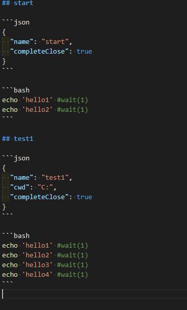
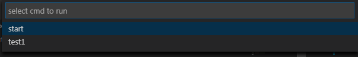

## cmdFlow

在 markdown 组织常用的 cmd 命令

## 使用 command

- cmdFlow.curFile 解析当前打开文件, 执行命令
- cmdFlow.global 解析全局配置文件, 执行命令

## 配置 config

config 分为两部分 terminal 配置+执行命令
terminal 设置是放在 json code 中,
使用格式是 [TerminalOptions](https://code.visualstudio.com/docs/extensionAPI/vscode-api#TerminalOptions)
额外的配置 completeClose,如果设置为 true 执行完成之后就自动关闭 terminal

执行命令放在 bash 中, 通过行来分割, 使用 terminal sendText api.
现在 vscode 没有提供 api 监听 terminal 的运行状态, 我只能监听 onDidWriteData,
如果一定时间 terminal 没有 output, 就认为 terminal 是空闲状态, 就执行下一条命令
wait(time: 单位秒)来表示命令需要等待的时间,你如果命令很长时间没有 output 建议将设置长些...

`"cmdFlow.global": string` 全局配置文件

## demos

json code terminal config: TerminalOptions
bash code cmd

[demo](./doc/cmd.md)

