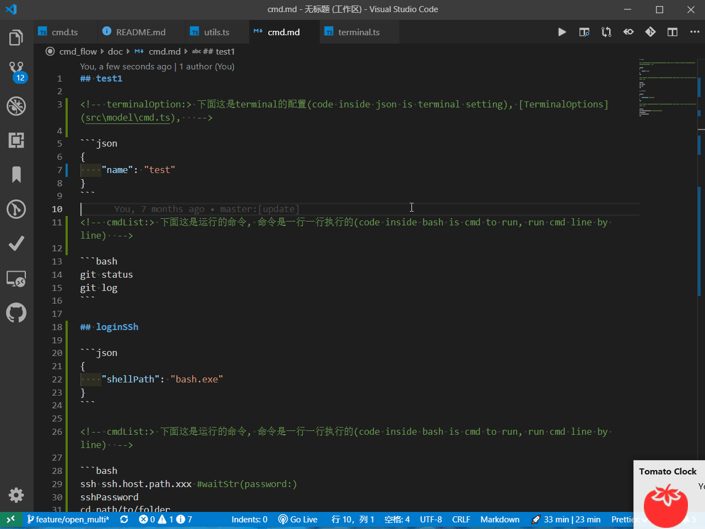

## cmdFlow



在 vscode terminal 中一条接一条运行 cmd.
(run cmd in vscode terminal one by one, use markdown organize cmd.)

## setting

-   `"cmdFlow.globalFile": string` 全局配置文件路径(global setting file path)

-   `"cmdFlow.workspaceFile": string` workspace 中每一个文件夹配置文件相对路径(setting file inside workspace folder)

## command

-   cmdFlow.listFile 解析所有配置文件(list all file for cmdFlow)
-   cmdFlow.listCmd 解析所有配置文件中的命令(list all cmd in cmdFlow.listFile)

## config

[demo](./doc/cmd.md)

### terminalOption

```ts
export type CmdOPt = TerminalOptions & {
    /** 运行完成是否自动关闭(auto close when complete run a cmd) */
    completeClose?: boolean;
    /** 是否隐藏(is hide terminal when run cmd) */
    hide?: boolean;
    /** 是否先执行其他命令 (is run other cmd before) */
    before?: string[];
    /** 是否通过task来执行  (is run cmd through task just like workbench.action.tasks.runTask) */
    is_task?: boolean;
};
```

### cmdList

...

## 原理

vscode terminal 并没有 api 通知一条命令执行完成, 这个功能是通过监听 terminal 的输出来实现的, window 和 linux 的默认结束字符 `>` `$`, 如果监听到存在这两个字符结尾, 那么就是一条命令执行完毕;
但是在某些情况下 terminal 的结束并不是以那两个字符结尾, 那么需要在的命令结尾加上`#waitStr(theWaitStr)`
(vscode doesn't provide api to notify when run cmd complete, this extension listen terminal output(onDidWriteData), it decide end when find output end with end char `>` `$` (windows or linux default terminal), terminal sometime desn't end with that two char, you need add `#waitStr(theWaitStr)` to end of the line, to tell cmfFlow what str is the end sign)
